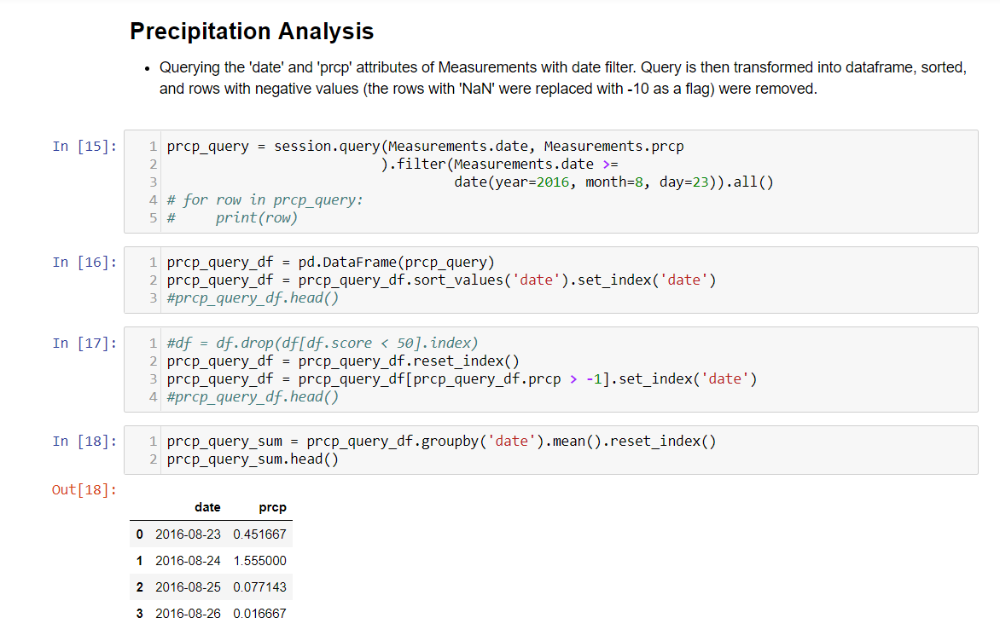
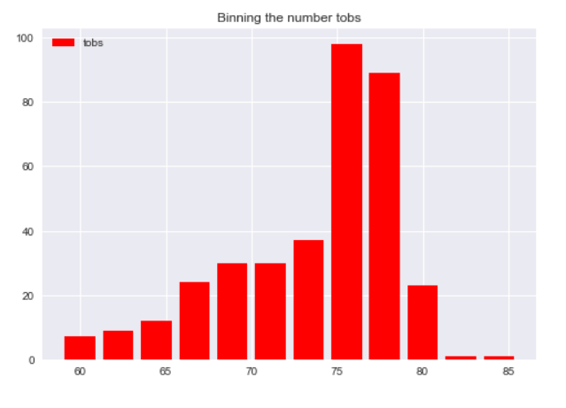
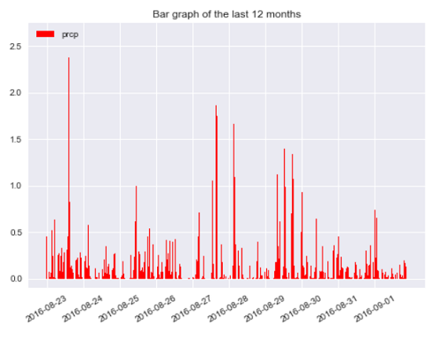

## Unit 9 | Working with SQLalchemy and Database building -

Skills Tested:  Python (Pandas), SQLalchemy, SQL, Object-oriented programming

This homework demonstrates building and querying a SQLite database via mostly Python, and minimal SQL commands.  Data is originally stored in CSV files where it is cleaned via Pandas, and then tables are created to map the database schema to the Python objects.  The underlying database can be managed via Python language.

Two CSV files are provided.  One with station information, and the other with station ids and readings.  The purpose of this homework is to clean the data via Python, and create a SQLite database in which to query and analyze data from using querying techniques via Python/SQLalchemy.  

______________________________________________________________________________________________________________________________________________

